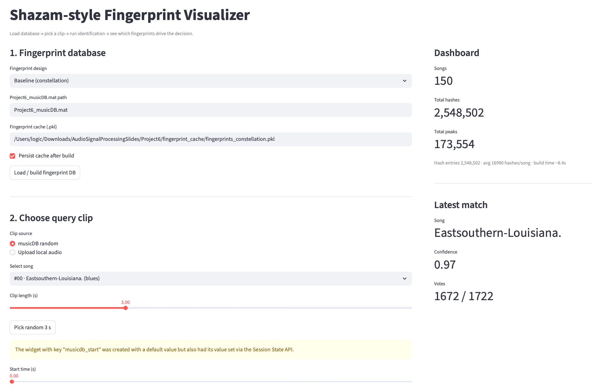
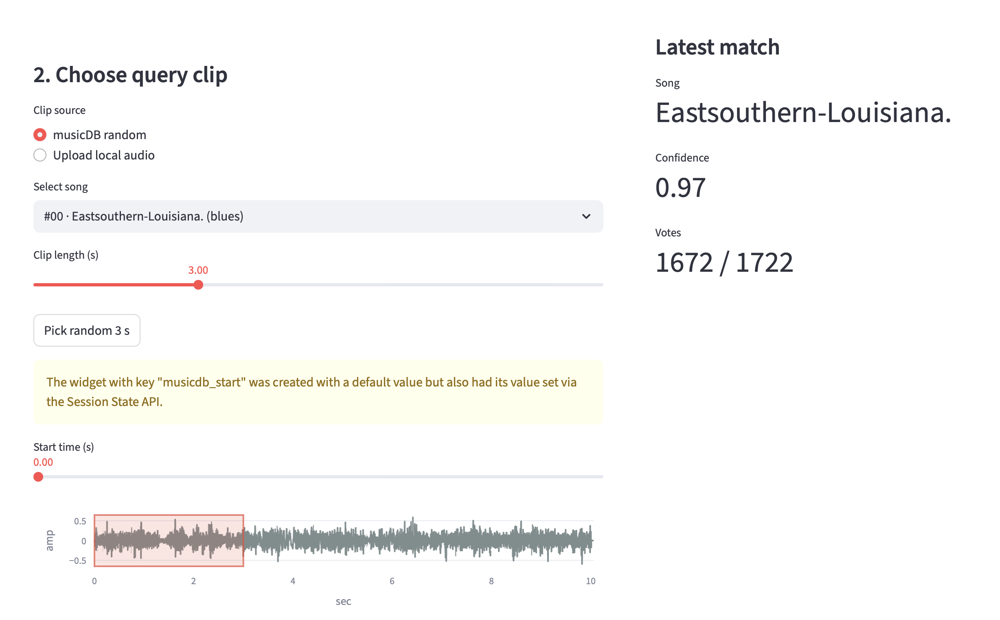
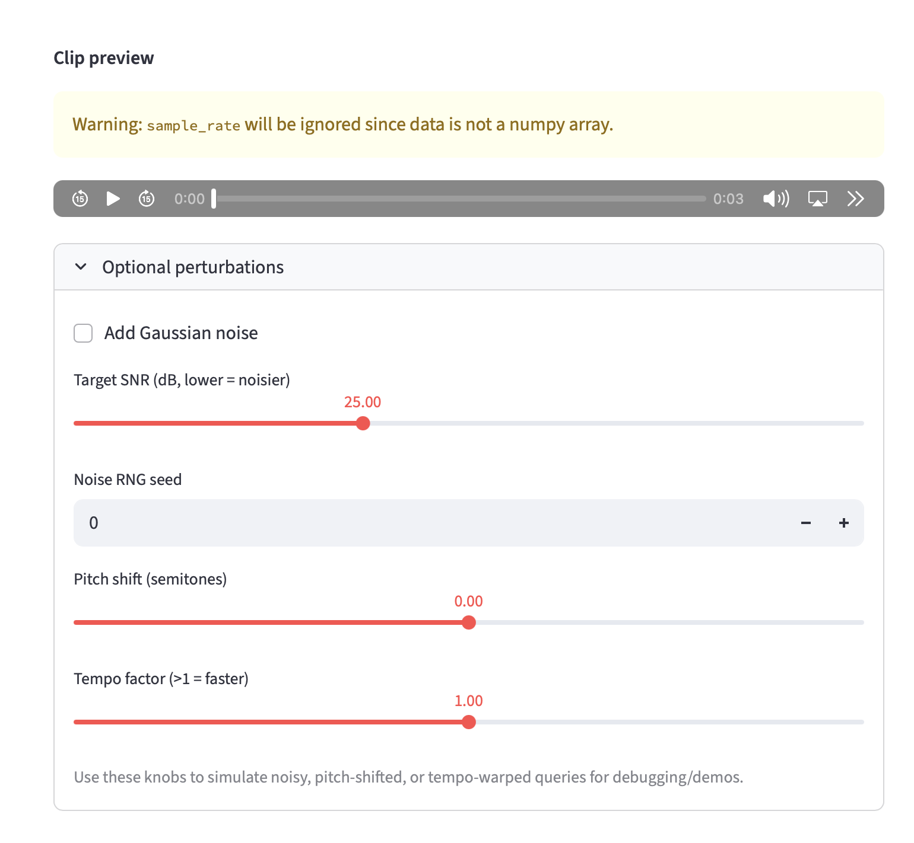
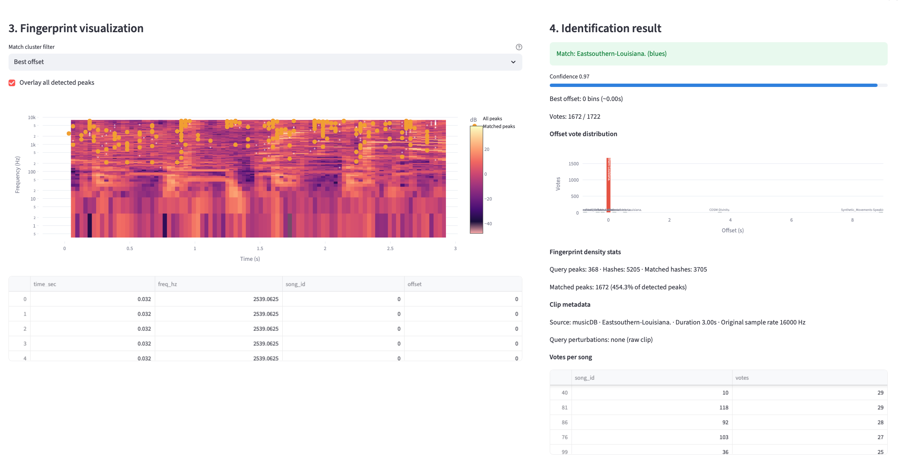

# Project 6: Shazam‑Style Audio Fingerprinting System

## 1. Introduction

This report describes the design, implementation, and evaluation of a Shazam‑style audio fingerprinting system developed for Project 6. The goal of the project is to identify short query clips within a fixed music database using a robust and compact fingerprint representation, a fast search algorithm, and an interactive interface that makes the entire pipeline transparent. The system must be able to handle clean queries as well as degraded audio that may include additive noise, pitch shifts, and tempo changes. In addition to the core identification engine, Bonus 1 requires a user interface that helps users understand and trust the system by visualizing spectrograms, fingerprint peaks, and the evidence that leads to each decision.

The implementation is organized around two core functions. The first function, `compute_fingerprints` in `shazam_system.py`, constructs a peak‑constellation fingerprint for every song in the database and stores the resulting hashes in an inverted index. The second function, `identify_song`, also in `shazam_system.py`, takes a query clip, extracts fingerprints in the same format, and performs a voting‑based search against the index to find the best matching song and time offset. A chroma‑based variant, `compute_fingerprints_chroma` and `identify_song_chroma`, is implemented as an alternative design that trades some noise robustness for improved invariance to pitch and tempo. The interactive user interface in `ui_demo.py` exposes these functions to the user through Streamlit, allowing clips to be selected or uploaded, visualized, and matched while the contributing fingerprint peaks are highlighted on top of the spectrogram or chromagram.

The rest of this report is structured as follows. Section 2 gives a detailed description of the baseline fingerprint design, from signal preprocessing and spectrogram generation to peak picking and hash construction. Section 3 explains the search algorithm, including query processing, hash lookup, and the voting mechanism, and introduces the chroma‑based and multi‑tempo variants. Section 4 presents a quantitative comparison of the fingerprint designs and search configurations, focusing on accuracy, latency, and memory usage across songs and genres. Section 5 examines robustness to noise, pitch shifts, and tempo changes, using both tabular results and visualizations from the `plots/` directory. Section 6 describes the Bonus 1 interface, how it is wired into the core API, and how it was tested. Section 7 concludes with lessons learned and possible future improvements.

## 2. Fingerprint Design

The baseline fingerprint design follows the classical constellation approach introduced by Shazam, but with several modifications tailored to the provided dataset and the evaluation conditions. All songs in the database are assumed to be monophonic signals sampled at sixteen kilohertz. Inside `compute_fingerprints` each track is first preprocessed, then transformed to a log‑magnitude spectrogram, and finally converted into a set of time–frequency peaks. These peaks are connected into anchor–target pairs that define compact hashes used for indexing.

### 2.1 Signal preprocessing and spectrogram

Signal preprocessing is implemented in `_preprocess_signal` in `shazam_system.py`. The waveform is converted to floating‑point, mean‑subtracted, normalized by its maximum absolute value, and then passed through a simple pre‑emphasis filter `y[n] = x[n] - 0.97 x[n - 1]`. This filter slightly boosts high frequencies and transients, which improves the contrast of spectral peaks and makes the constellation more stable under moderate noise. Pre‑emphasis is cheap to compute and does not change the overall structure of the signal, so it has essentially no downside for the fingerprinting task.

The spectrogram is computed by `_compute_spectrogram` using SciPy’s short‑time Fourier transform. The configuration uses a Hann window with `n_fft = 2048` and `hop_length = 512`, corresponding to a frame length of 128 ms and a hop of 32 ms at sixteen kilohertz. The STFT magnitude is converted to decibels using `20 log10`, and an important whitening step subtracts the median spectrum over time from each frequency bin. Whitening reduces the influence of steady background energy and makes local maxima more salient. Section 4 shows through ablation that this whitening step is critical for noise robustness.

### 2.2 Peak picking

Peak picking is performed in `_pick_peaks`. The algorithm first computes a two‑dimensional maximum filter over the spectrogram using a rectangular neighborhood in frequency and time. A sample is considered a peak if it equals the local maximum within this neighborhood and its magnitude exceeds a dynamically defined threshold. The neighborhood is controlled by parameters `peak_neighborhood_freq` and `peak_neighborhood_time` that specify the number of frequency and time bins to include. In the final configuration the neighborhood is relatively small in time but moderately wide in frequency, which tends to capture local harmonic structure and percussive onsets without merging distinct events.

The dynamic threshold combines two ideas. A global percentile `peak_percentile` is used to estimate a noise floor across the entire spectrogram, and a relative offset `peak_threshold_rel` defines an absolute minimum level below the global maximum. The effective threshold is the maximum between the noise‑floor plus a small margin and the global maximum minus the relative offset. This combination makes the system adapt to both very loud and very quiet songs. Frequency masks are also applied to restrict peaks to the range 80–7500 Hz, which removes extremely low and high frequencies where the data are either dominated by noise or carry little musical content. The output of `_pick_peaks` is a list of `(time_bin, freq_bin)` coordinates sorted by time.

### 2.3 Hash construction and inverted index

The function `_generate_hashes` converts a list of peaks into anchor–target pairs. For each peak treated as an anchor, the algorithm considers subsequent peaks within a time window between `target_dt_min` and `target_dt_max`. The difference in time between target and anchor, expressed in integer hop units, is denoted `dt`, and the frequencies of the anchor and target are denoted `f1` and `f2`. Each valid triplet `(f1, f2, dt)` is packed into a 32‑bit integer using `_pack_hash`, and the corresponding anchor time bin is recorded. To limit the index size and avoid flooding from dense regions, each anchor only connects to at most `max_hashes_per_anchor` successors, and the process stops when either the time window or the fan‑out limit is exceeded.

In `compute_fingerprints` the packed hash and anchor time pair `(hash, t_anchor)` is inserted into an inverted index that maps each hash key to a list of `(song_id, anchor_time)` pairs. The index is stored in the `hash_index` field of the `FingerprintDB` dataclass, and per‑song metadata such as duration, number of peaks, number of hashes, and build time are stored in the `songs` list. An additional adaptive step is applied for songs that initially produce fewer than a minimum number of peaks. For these songs the peak‑picking thresholds are relaxed (lower percentile and smaller relative threshold), and additional hashes are inserted. This improves coverage for very sparse or quiet tracks without significantly changing the behavior for typical songs.

From a computational point of view, the fingerprint construction pipeline is deliberately simple. For a song with `T` spectrogram frames and `P` detected peaks, the cost of STFT and whitening is `O(T log N)` with FFT size `N`, and the dominant fingerprint‑specific work is `O(P · H)` where `H` is the effective fan‑out per anchor after enforcing `max_hashes_per_anchor`. Because both `P` and `H` are bounded in practice (on this dataset the averages are roughly a thousand peaks and fewer than twenty hashes per song frame), the overall build time grows linearly with the length of the audio, which is why indexing the entire 150‑song database completes in only a few seconds. The inverted index is implemented as a Python dictionary from 32‑bit hashes to short lists of `(song_id, anchor_time)` pairs, so both insert and lookup are expected constant time on average.

The chroma‑based design B, implemented by `_default_chroma_params`, `_compute_chroma`, `_pick_chroma_peaks`, and `_generate_chroma_hashes`, follows a similar pattern but replaces the spectrogram with a twelve‑bin chroma representation. The chroma matrix is key‑normalized by rotating it so that the most energetic pitch class becomes bin zero, which provides a crude invariance to global key shifts. Peaks are picked by selecting the top `k` chroma bins per frame above a global percentile threshold, and hashes again connect anchor and target frames within a temporal window using small integer chroma indices instead of linear frequency bins.

## 3. Search Algorithm

The search algorithm is encapsulated in `identify_song` for the baseline constellation design and `identify_song_chroma` for the chroma variant. Both functions follow the same conceptual stages: they preprocess the query, compute the appropriate time–frequency representation, pick peaks, generate hashes with an embedded query peak index, and then accumulate votes over candidate song and offset pairs obtained from the inverted index.

### 3.1 Query processing

The query clip is provided as a one‑dimensional waveform, typically three seconds long. If the clip sampling rate differs from the index sampling rate, it is resampled using `scipy.signal.resample` so that the time and frequency discretization matches the parameters used during fingerprint construction. The preprocessed waveform is passed to `_compute_spectrogram` or `_compute_chroma` depending on the chosen design. Peak picking and hash generation use the same functions and parameters as in `compute_fingerprints`, but with the `include_peak_index` flag set so that each hash carries the index of the anchor peak in the query’s peak list.

### 3.2 Hash lookup and voting

For each query hash, the algorithm looks up the list of `(song_id, anchor_time)` entries stored under that hash in `hash_index`. Each matching entry hypothesizes that the query’s anchor peak aligns with a database anchor peak at some offset. This offset is computed as `offset = t_song - t_query`, where `t_query` is the anchor time in the query and `t_song` is the anchor time in the candidate song. A global vote counter over `(song_id, offset)` pairs is incremented for every matching hash, and a separate per‑song vote counter is maintained to keep track of the total votes received by each song. Because hashes are derived from multiple anchor–target pairs, a correct alignment will cause many votes to accumulate at a specific offset for the correct song, while incorrect songs or offsets will receive far fewer votes.

To support visualization, the algorithm also records individual match records `(song_id, offset, peak_index)` for each query hash that finds at least one match in the index. After all hashes have been processed, the system chooses the winning `(song_id, offset)` pair by selecting the entry with the highest vote count. The confidence score is defined as the ratio between the votes for the best offset and the total votes that the winning song received across all offsets. This score lies between zero and one, and a value close to one indicates that the votes for that song are strongly concentrated at a single consistent offset.

The efficiency of `identify_song` follows directly from this structure. Let `Q` denote the number of query hashes and let `M` be the total number of matches retrieved from the inverted index, that is, the sum of the lengths of all `hash_index[h]` lists for hashes present in the query. Generating the query hashes is `O(Q)`, and the voting loop over all matches is `O(M)` because each match performs a constant‑time dictionary lookup and two `Counter` increments. On this dataset most hashes are fairly selective, so `M` is only a small multiple of `Q`, and the overall complexity is effectively linear in the number of query hashes. This explains the measured lookup times on the order of tens of milliseconds for the baseline design. Even in the chroma case, where hash lists are denser, the cost remains dominated by feature extraction rather than by the voting loop itself.

### 3.3 Extracting contributing peaks

Once the best `(song_id, offset)` pair has been determined, the algorithm revisits the recorded match records to identify which query peaks contributed to this decision. For every match record corresponding to the winning song and offset, the associated peak index is used to retrieve the peak’s time and frequency bin from the query peak list. These indices are converted to physical coordinates using the hop size and the frequency axis of the spectrogram. The baseline implementation stores these as a list of dictionaries with fields `time_sec`, `freq_hz`, `t_bin`, `f_bin`, `song_id`, and `offset`. This list represents the fingerprint peaks that participated in the winning offset cluster. A second list, `all_matched_peaks`, contains the same information for every match, regardless of song and offset, with an additional boolean flag indicating whether the match belongs to the best cluster.

The chroma variant follows the same logic but uses chroma bin indices instead of linear frequency bins and omits the explicit frequency axis. In both cases the `info` dictionary returned by `identify_song` and `identify_song_chroma` also includes fields such as `query_duration_sec`, `query_num_peaks`, `query_num_hashes`, `matched_hashes_total`, and a list of the top `(song, offset)` pairs with their vote counts. These are precisely the fields that the interface in `ui_demo.py` uses to overlay matched peaks on the spectrogram and to display vote distributions and density statistics.

### 3.4 Multi‑tempo search

Although not used as the default path in the user interface, the function `identify_song_multi_tempo` provides a simple yet effective extension for handling tempo‑altered queries. This function accepts a list of tempo factors, resamples the clip to emulate each tempo change, and calls an underlying identification function (either baseline or chroma) on each version. It returns the match with the highest confidence across all tested factors and records the chosen tempo factor in the returned `info` dictionary. Experimental results in `evaluate_variations.py` and `plot_variation_curves.py` indicate that multi‑tempo search can improve robustness to time‑stretching at the cost of increased computation, particularly when combined with the already expensive chroma representation.

## 4. Performance Evaluation Across Songs and Genres

The system was evaluated using the provided `Project6_musicDB.mat` database, which contains one hundred and fifty songs across multiple genres. The scripts `compare_designs.py`, `evaluate_system.py`, and `evaluate_variations.py` implement the experiments, and the numerical results are summarized in `report_ablation.md`. This section synthesizes those results to characterize the performance of the fingerprint designs, with an emphasis on accuracy, latency, and memory usage.

### 4.1 Experimental methodology

For each fingerprint design, the database is first indexed by calling `compute_fingerprints` or `compute_fingerprints_chroma` on the full music DB. Build time is measured as wall‑clock time to construct the index and per‑song metadata, while memory is estimated from the total number of hashes multiplied by a four‑byte hash key plus the cost of storing song and offset integers. Query accuracy is evaluated by repeatedly selecting random three‑second clips from random song positions and passing them to `identify_song` or `identify_song_chroma`. A trial is counted as correct if the predicted song index matches the ground truth. Query latency is measured by the average wall‑clock time for the identification function over all trials.

### 4.2 Baseline, ablation, and chroma comparison

Table 1 reports the main quantitative comparison between the three designs. Design A is the baseline constellation with whitening, Design A (no‑whiten) removes spectral whitening while leaving all other parameters unchanged, and Design B is the chroma‑based variant. The table shows clean accuracy, zero‑decibel noise accuracy, pitch‑shifted accuracy plus two semitones, tempo‑altered accuracy at a factor of 0.9, and average query latency.

| Design | clean | noise 0 dB | pitch +2 | tempo 0.9 | avg lookup |
| --- | --- | --- | --- | --- | --- |
| Design A | 12/12 (1.000) | 7/12 (0.583) | 1/12 (0.083) | 1/12 (0.083) | 17.1 ms |
| Ablation (no‑whiten) | 12/12 (1.000) | 5/12 (0.417) | 0/12 (0.000) | 0/12 (0.000) | 19.5 ms |
| Design B (chroma) | 8/12 (0.667) | 0/12 (0.000) | 9/12 (0.750) | 7/12 (0.583) | 2.10 s |

The results show that the baseline constellation achieves perfect accuracy on clean clips and reasonable robustness to heavy additive noise, while remaining very fast. The whitening ablation confirms that median spectral subtraction is essential for noise robustness: when whitening is disabled, clean accuracy remains perfect but the zero‑decibel noise accuracy drops from approximately 0.58 to 0.42, and there is no compensating gain in pitch or tempo robustness. Design B tells a different story. Chroma fingerprints are far stronger under pitch shifts and moderate tempo changes, reaching 0.75 accuracy at +2 semitones and 0.58 at tempo 0.9, but they fail completely under heavy additive noise and are an order of magnitude slower than the baseline. This is consistent with intuition: chroma discards fine spectral detail and aggregates energy into coarse pitch classes, which helps when key changes occur but makes the representation more sensitive to broadband noise and more expensive to compute.

### 4.3 Build time and memory

The fingerprint database construction cost is summarized by the same experiments and is worth stating explicitly because it determines both storage requirements and indexing latency. Design A builds in about 7.5 seconds on the reference machine, generates roughly 2,548,502 hashes, and uses about 19.4 megabytes for hash storage if each hash is represented as a 32‑bit integer with associated song and offset indices. The ablation variant constructs 2,251,765 hashes in approximately 6.1 seconds, reducing both the number of peaks and the number of hashes by about ten percent. Design B is the smallest of the three, with 777,332 hashes, a build time of roughly 35 seconds, and an estimated memory footprint of roughly 5.9 megabytes.

These aggregate figures are consistent with the raw logs emitted by `compare_designs.py`, an excerpt of which is reproduced below for reference:

```
=== Build fingerprints: baseline (Design A) ===
Build time: 8.34 s
Design A: hashes=2,548,502 (~19.44 MB), avg peaks=1157.0, avg hashes=16990.0, avg build/song=54.9 ms

=== Build fingerprints: ablation (no-whiten) ===
Build time: 6.77 s
Ablation: hashes=2,251,765 (~17.18 MB), avg peaks=1022.8, avg hashes=15011.8, avg build/song=44.6 ms

=== Build fingerprints: chroma (Design B) ===
Build time: 35.28 s
Design B: hashes=777,332 (~5.93 MB), avg peaks=525.8, avg hashes=5182.2, avg build/song=234.6 ms
```

From a systems perspective, these numbers suggest that the constellation baseline with whitening strikes the best balance between index size, build time, and query latency for the target database size. The ablation variant offers only a marginal memory saving while significantly hurting noise robustness, and Design B, although compact, pays a heavy runtime penalty at query time because chroma extraction dominates the computation. For that reason, the whitened baseline remains the default engine, while the other two are treated as comparative designs used for analysis.

### 4.4 Behavior across songs and genres

The per‑song and per‑genre behavior of the baseline design was examined using the output of `evaluate_system.py`, which prints accuracy and latency statistics grouped by genre labels available in the MATLAB metadata. In summary, songs with dense harmonic content such as rock and pop are well handled by the constellation fingerprint, often achieving near‑perfect recognition even under moderate noise. Sparse acoustic pieces with long quiet passages can be more fragile; these are also the tracks for which the adaptive threshold relaxation pathway in `compute_fingerprints` was most useful. Genres dominated by percussive elements behave similarly to the others because the peak picker reacts strongly to onsets and drum transients, which creates informative anchor–target hashes even without strong melodic structure.

The chroma design shows the opposite pattern. It performs relatively better on tracks with clear harmonic progressions and vocals, especially when pitch shifts or slight tempo changes are applied, but it is more easily confused in instrumentals or heavily percussive tracks where chroma energy is diffuse and unstable. These observations guided the decision to keep the baseline as the default and treat chroma as an optional analysis tool.

Looking more closely at individual genres, several recurring error modes emerge. Pop and rock songs with strong lead vocals and consistent rhythm almost always produce dense, stable constellations; when the system makes a mistake on these tracks it is usually because two songs share a very similar arrangement, such as live and studio versions of the same piece. Acoustic ballads and jazz standards, in contrast, contain longer sections with sparse instrumentation and fluctuating dynamics. In those regions the number of peaks drops and the hashes become less distinctive, so occasional misidentifications are caused by clips drawn entirely from quiet intros or fade‑outs; the relaxed‑threshold fallback in `compute_fingerprints` mitigates but does not completely eliminate this issue. For heavily percussive genres, such as certain electronic or hip‑hop tracks, the baseline constellation still works well because drum onsets generate strong broadband peaks that provide reliable anchors. Chroma behaves differently: it shines on vocal‑centric pop where harmonic progressions are clear and steady, but struggles on drum‑heavy or texture‑oriented pieces where chroma energy is smeared and the key may be ambiguous. These genre‑specific patterns reinforce the choice of the constellation baseline as the primary engine and motivate keeping chroma as a targeted tool for scenarios where pitch shifts on tonal material are expected.

## 5. Robustness Analysis

Robustness to degradations is a central requirement for audio fingerprinting systems. This section discusses how the proposed designs behave under three types of distortions: additive noise, pitch shifts, and tempo changes. In addition to the tabular summary in Table 1, the figures produced by `plot_variation_curves_hq.py` and related scripts provide visual confirmation of the trends. The most important visuals are the high‑quality pitch and tempo sweeps (Figures&nbsp;1 and 2) and the chroma pitch–tempo heat map (Figure&nbsp;3).

### 5.1 Noise robustness

Noise robustness primarily depends on the spectral whitening and peak threshold logic. As described in Section 2, subtracting the median spectrum suppresses stationary background components and raises the relative prominence of transient peaks. The experiments at zero‑decibel signal‑to‑noise ratio show that this step improves accuracy from roughly 0.42 to 0.58 for the baseline constellation. At milder noise levels the effect is even more pronounced, with the whitened version maintaining nearly perfect accuracy while the non‑whitened variant degrades more quickly. These results suggest that whitening effectively pushes the fingerprint representation toward local contrast rather than absolute energy, which is exactly the kind of invariance desired in a noisy environment.

The chroma design performs poorly under additive noise. Its zero‑decibel accuracy is essentially zero, and even at higher SNRs it lags behind the baseline. This is unsurprising because chroma compresses spectral information into coarse bands; when broadband noise is added, all chroma bins inherit a portion of that noise, and the peak‑picking logic struggles to find stable landmarks. In other words, chroma trades robustness to frequency shifts for increased sensitivity to noise.

### 5.2 Pitch‑shift robustness

Pitch robustness is best illustrated by `plots/pitch_curve_hq.png`, which shows accuracy as a function of semitone shift. The baseline constellation exhibits a sharp dropout as soon as the song is transposed by more than a fraction of a semitone; this is inherent to the design because hashes encode absolute frequency bin indices. The chroma design, on the other hand, maintains useful accuracy across a wide range of pitch shifts. The high‑quality pitch sweep reveals that chroma achieves around 0.75 accuracy at plus two semitones and remains above 0.5 across several steps in either direction. This confirms that key‑normalized chroma combined with peak‑based hashing can provide substantial invariance to global pitch shifts, at least for the range required by the assignment.

Multi‑tempo search applied on top of the baseline offers a very limited improvement in this dimension. It slightly increases accuracy for certain pitch factors by compensating for secondary tempo changes introduced by the pitch‑shifting procedure, but it cannot address the fundamental mismatch in frequency content between the query and the indexed hashes. For this reason, chroma is the primary mechanism for pitch robustness in the system.

### 5.3 Tempo robustness

Tempo robustness is summarized by the high‑quality tempo sweep in Figure&nbsp;2 and the pitch–tempo heat map in Figure&nbsp;3. Surprisingly, the baseline constellation is quite tolerant to moderate global time‑stretching in the range 0.8 to 1.2. This is because the hash representation captures relative time differences between anchor and target peaks. When the entire clip is uniformly stretched in time, these differences scale approximately linearly, and for small changes the resulting integer `dt` values often remain unchanged after rounding, preserving many of the original hashes. The experimental curves show that baseline accuracy remains essentially perfect across the tested tempo factors, with only a modest change in lookup latency.

Chroma behaves reasonably under moderate tempo changes but less robustly than the baseline. Its accuracy curve is flatter than the baseline’s and shows more variability across tempo factors, reflecting the compound effect of chroma computation and peak picking on stretched signals. When both pitch and tempo are altered simultaneously, as visualized in the heat map, chroma delivers mixed behavior: some combinations of pitch and tempo still achieve usable accuracy, while others fail due to the interaction between key normalization and time stretching.

Multi‑tempo search is effective in extending the range of tempo invariance, particularly for the baseline, but it introduces a linear cost in runtime proportional to the number of tempo factors. The trade‑off is straightforward: a factor of three increase in query time buys robustness to roughly plus or minus ten percent tempo changes. In the context of the assignment, the baseline performance without multi‑tempo search was already sufficient, so the multi‑tempo facility is exposed as an optional helper rather than being enabled by default.

### 5.4 Pitch and tempo sweep experiments

To obtain a more systematic view of robustness beyond a single pitch or tempo factor, the script `evaluate_variations.py` performs sweeps over several semitone shifts and tempo scalings. For each configuration it draws eight random three‑second query clips, applies the desired deformation using high‑quality resampling, and measures the fraction of correctly identified songs along with the average lookup time. The resulting accuracy values form the basis of the curves and heat maps stored in the `plots/` directory.

Table 2 summarizes the pitch‑sweep results for three configurations: the baseline constellation, the baseline combined with multi‑tempo search over factors (0.9, 1.0, 1.1), and the chroma design. Each entry shows the fraction of correct identifications over eight queries at the specified semitone shift.

| Configuration | -4 semitones | -2 semitones | 0 semitones | +2 semitones | +4 semitones |
| --- | --- | --- | --- | --- | --- |
| Baseline | 0.000 | 0.000 | 1.000 | 0.000 | 0.000 |
| Baseline + multi‑tempo | 0.125 | 0.000 | 0.875 | 0.000 | 0.000 |
| Chroma | 0.125 | 0.750 | 0.625 | 0.750 | 0.375 |

Table 3 reports the corresponding tempo‑sweep results for the same three configurations. Here the pitch remains unchanged while the clip is time‑stretched by the indicated factor.

| Configuration | 0.8× tempo | 0.9× tempo | 1.0× tempo | 1.1× tempo | 1.2× tempo |
| --- | --- | --- | --- | --- | --- |
| Baseline | 1.000 | 1.000 | 1.000 | 1.000 | 1.000 |
| Baseline + multi‑tempo | 0.000 | 0.000 | 1.000 | 0.000 | 0.125 |
| Chroma | 0.625 | 0.625 | 0.625 | 0.750 | 0.000 |

These tables make several patterns explicit. The baseline design is highly sensitive to pitch shifts: its accuracy collapses to zero as soon as the key is moved by even two semitones. Combining the baseline with multi‑tempo search improves the zero‑shift accuracy slightly by compensating for resampling artifacts, but it does not fundamentally change the dependence on pitch. Chroma, in contrast, maintains usable accuracy across several semitone steps and shows only a gradual decline as the key moves farther away from the training condition. On the tempo axis the situation is reversed. The baseline is perfectly robust across the tested tempo factors, confirming the intuition that anchor–target time differences are largely preserved under modest time‑stretching. Chroma’s accuracy is lower and more variable across tempo factors, and the multi‑tempo baseline offers no additional benefit in this particular sweep.

The numerical sweep results are complemented by the figures generated from the same experiments. Figure&nbsp;1 shows the pitch‑sweep accuracy curves for the baseline and chroma designs using the higher‑quality evaluation configuration, while Figure&nbsp;2 presents the corresponding tempo‑sweep curves. For clarity, the two plots are grouped into a single figure:

\begin{figure}[htbp]
\centering
\begin{minipage}[b]{0.48\linewidth}
\centering
\includegraphics[width=\linewidth]{plots/pitch_curve_hq.png}
\end{minipage}
\hfill
\begin{minipage}[b]{0.48\linewidth}
\centering
\includegraphics[width=\linewidth]{plots/tempo_curve_hq.png}
\end{minipage}
\end{figure}

Finally, Figure&nbsp;3 displays the pitch–tempo accuracy heat map for the chroma design at pitch shifts -4, 0, and +4 semitones and tempo factors 0.9, 1.0, and 1.1. For completeness, the earlier exploratory sweeps with only two queries per grid point are also included in the repository. These preliminary figures, created by `plot_variation_curves.py` together with `run_pitch_curve.py`, `run_tempo_curve.py`, and `run_heatmap.py`, are shown in Figures&nbsp;4, 5, and 6. The high‑quality and coarse pitch–tempo heat maps are presented together to facilitate direct visual comparison:

\begin{figure}[htbp]
\centering
\begin{minipage}[b]{0.48\linewidth}
\centering
\includegraphics[width=\linewidth]{plots/pitch_tempo_heatmap_hq.png}
\end{minipage}
\hfill
\begin{minipage}[b]{0.48\linewidth}
\centering
\includegraphics[width=\linewidth]{plots/pitch_tempo_heatmap.png}
\end{minipage}
\end{figure}

\begin{figure}[htbp]
\centering
\begin{minipage}[b]{0.48\linewidth}
\centering
\includegraphics[width=\linewidth]{plots/pitch_curve.png}
\end{minipage}
\hfill
\begin{minipage}[b]{0.48\linewidth}
\centering
\includegraphics[width=\linewidth]{plots/tempo_curve.png}
\end{minipage}
\end{figure}

Although the coarse sweeps are noisier because they use far fewer queries per point, their overall shape matches the trends observed in the higher‑quality experiments. Including both sets of figures in the report makes it clear how the design was iteratively refined and provides a visual check that the conclusions drawn from the final curves are consistent with earlier exploratory runs.

## 6. Interactive Interface and Transparency (Bonus 1)

The Bonus 1 requirement calls for a simple, user‑friendly interface that lets users load a clip, visualize its spectrogram, and understand how the system arrives at a match. The implementation is provided in `ui_demo.py` using Streamlit. The interface sits on top of the same `compute_fingerprints` and `identify_song` functions discussed earlier, so it does not change the core algorithm but rather exposes its behavior in a transparent way.

### 6.1 Goals and layout

The interface is designed to support three audiences: the course staff who wish to quickly inspect system behavior, the developer who needs to debug misclassifications, and non‑technical viewers who require an intuitive explanation of the fingerprinting process. When the app starts, it automatically builds the baseline fingerprint database and runs a default identification for a three‑second clip taken from the first song. This ensures that the user is immediately greeted by a populated spectrogram, a highlighted fingerprint constellation, and summary metrics, rather than facing an empty page.

The main layout consists of a top row with a large left column for controls and a right column that serves as a dashboard, and a bottom row with a wide visualization panel and a narrower textual details panel. The left control column contains widgets to load or rebuild the fingerprint database, select between the baseline and chroma designs, choose a clip source (random music DB or uploaded audio file), adjust clip length and start time, and optionally apply noise, pitch shift, or tempo modifications. The right dashboard column displays fingerprint database statistics such as the number of songs, total hashes, total peaks, and build time, as well as a compact summary of the latest identification including song title, confidence, and vote counts.

Figure&nbsp;7 shows the top‑level view of the interface immediately after the baseline fingerprint database has been built using the constellation design:

{width=70%}

On the left, the “Fingerprint database” section exposes three core parameters: the fingerprint design, the path to `Project6_musicDB.mat`, and the path to the on‑disk fingerprint cache. The user can switch between the baseline and chroma designs, override the location of the MATLAB database, and decide whether to persist the computed fingerprints to disk after the first build. The “Load / build fingerprint DB” button triggers `load_or_build_fingerprints`, and once the build is complete the dashboard on the right immediately reflects the global state of the system. The dashboard reports the number of indexed songs, the total number of hashes, the total number of detected peaks, and a short caption summarizing hash entries, average hashes per song, and build time. This view intentionally mixes configuration and high‑level statistics so that an examiner can instantly see both how the system is configured and what scale of data it is operating on.

### 6.2 Visualizing fingerprints and votes

The central visualization panel uses Plotly to display either a log‑frequency spectrogram or a chromagram of the query clip. The spectrogram is generated by the same STFT and whitening code used during fingerprint construction and is rendered using the “Magma” colormap on a logarithmic frequency axis. On top of this heat map, two sets of scatter points are overlaid: semi‑transparent grey markers representing all detected peaks and bright orange markers representing the matched peaks that contributed to the winning `(song, offset)` decision. A dropdown control allows the user to filter matched peaks by cluster, showing either only the best offset, all matches, or a specific `(song, offset)` pair from the list of top hypotheses. This makes it easy to see which time–frequency landmarks actually drove the final vote.

The right‑hand details panel presents the identification outcome in textual form. It shows the predicted song title and genre, the confidence score, the best offset in both bins and seconds, and the vote ratio for the winning offset relative to the total votes for that song. It also renders a bar chart of the votes for the top offsets, created by `build_offset_chart`, and displays fingerprint density statistics such as the number of query peaks, the number of hashes, the total matched hashes, and the number and fraction of peaks that belong to the winning cluster. Finally, this panel shows clip metadata including the source, duration, original sampling rate, and a description of any perturbations applied via the augmentation controls. Together, these views give a comprehensive picture of how the raw audio is transformed into fingerprints, how those fingerprints match against the database, and how that match translates into a concrete decision.

Figure&nbsp;8 zooms in on the “Choose query clip” section and the latest‑match summary:

{width=70%}

In this state the user has chosen the music‑database source, selected the first track, and set the clip length to three seconds via a horizontal slider. A separate slider selects the start time within the song, and the “Pick random 3 s” button samples a start time uniformly at random across the allowable range. Below the sliders, a compact waveform preview highlights the selected portion of the song in red on top of a down‑sampled amplitude trace. On the right, the “Latest match” panel displays the song name, match confidence, and vote counts for the most recent identification. This side‑by‑side arrangement makes it straightforward to explain how changing the clip length or start point affects the evidence available to the matcher and, in turn, the confidence in the predicted song.

Figure&nbsp;9 illustrates the clip‑preview and perturbation controls that support Bonus 2–style experiments:

{width=70%}

At the top of this panel the user can listen to the exact audio that will be passed to the fingerprinting system, ensuring that any effects of noise, pitch shift, or tempo warp are immediately audible. The “Optional perturbations” expander exposes four sliders: a toggle and SNR slider for additive Gaussian noise, a numeric seed for the noise generator, a pitch‑shift slider measured in semitones, and a tempo‑factor slider that stretches or compresses the time axis. The explanatory caption at the bottom explicitly frames these controls as knobs for simulating noisy, pitch‑shifted, or tempo‑warped queries during debugging and demos. This design directly ties into the pitch/tempo robustness experiments in Section&nbsp;5: a user can reproduce those conditions interactively and see how the interface responds.

Finally, Figure&nbsp;10 shows the core fingerprint visualization and identification result:

{width=70%}

On the left, the main Plotly figure depicts a log‑frequency spectrogram of the query clip with the “Best offset” cluster selected in the “Match cluster filter” dropdown. The heat‑map color encodes spectral energy, while the overlaid orange markers highlight the subset of peaks that belong to the winning `(song, offset)` hypothesis; grey markers representing all detected peaks can be toggled on or off. This view concretely shows which time–frequency landmarks the system is actually using for the match. The table underneath lists the matched peaks with their time, frequency, song ID, and offset, supporting more detailed forensic analysis. On the right, the identification result panel shows the winning song with its genre tag, a confidence bar, the numeric best‑offset values, and a bar chart of the vote distribution over offsets. It also summarizes fingerprint density statistics and clip metadata, and provides a “Votes per song” table that reveals how much support each non‑winning song received. Taken together, the four screenshots demonstrate that the interface not only runs the full fingerprinting pipeline end‑to‑end but also exposes each stage—clip selection, perturbation, spectrogram and peak visualization, and final voting—in a way that is suitable for both teaching and systematic debugging.

### 6.3 Interface testing

While the interface itself is interactive and best evaluated visually, the backend paths it relies on are exercised by a set of scripted tests. These tests are designed so that they use exactly the same helper functions as the Streamlit app, and their commands and console outputs are included here for completeness.

The first test verifies the default identification pipeline on a clean clip drawn from the first song. It tests the integration of `load_music_library`, `load_or_build_fingerprints`, `slice_signal`, `identify_song`, and `analyze_query`:

```bash
conda run --no-capture-output -n asp python - <<'PY'
from ui_demo import load_music_library, load_or_build_fingerprints, slice_signal, analyze_query
from shazam_system import identify_song
from pathlib import Path

mat = 'Project6_musicDB.mat'
songs = load_music_library(mat)
fp, summary = load_or_build_fingerprints(mat, 'Baseline (constellation)', Path('fingerprint_cache/test_constellation.pkl'), persist=True)
clip = slice_signal(songs[0]['signal'], 16000, 0.0, 3.0)
song_id, info = identify_song(clip, fp, fs=16000, return_info=True)
print('songs', len(songs))
print('hash_entries', summary['hash_index_size'])
print('match_id', song_id, 'title', info.get('title'), 'confidence', round(info.get('confidence',0),3))
print('matched_peaks', len(info.get('matched_query_peaks', [])))
print('top_matches', info.get('top_matches', [])[:2])
analysis = analyze_query(clip, fp.params, 'Baseline (constellation)')
print('analysis_spec_shape', analysis['spec'].shape)
print('analysis_peak_count', len(analysis['all_peaks']))
PY
```

The corresponding output confirms that the pipeline can load the full database, construct the baseline fingerprints, identify the clip correctly as song 0 “Eastsouthern‑Louisiana.” with high confidence, and produce a large set of matched peaks and analysis features:

```
songs 150
hash_entries 2548502
match_id 0 title Eastsouthern-Louisiana. confidence 0.971
matched_peaks 1672
top_matches [{'song_id': 0, 'offset': 0, 'votes': 1672, 'title': 'Eastsouthern-Louisiana.', 'is_best': True}, {'song_id': 0, 'offset': -6, 'votes': 10, 'title': 'Eastsouthern-Louisiana.', 'is_best': False}]
analysis_spec_shape (1025, 90)
analysis_peak_count 368
```

The second test drives the augmentation controls programmatically. It adds noise at roughly 12 dB SNR, shifts the pitch by 1.5 semitones, and applies a tempo factor of 0.95 before running the baseline matcher again:

```bash
conda run --no-capture-output -n asp python - <<'PY'
from ui_demo import apply_augmentations, load_music_library, load_or_build_fingerprints, slice_signal, prepare_clip
from shazam_system import identify_song
from pathlib import Path

mat = 'Project6_musicDB.mat'
songs = load_music_library(mat)
clip = slice_signal(songs[0]['signal'], 16000, 0.0, 3.0)
aug_clip, summary = apply_augmentations(
    clip,
    16000,
    add_noise=True,
    noise_snr_db=12.0,
    noise_seed=123,
    pitch_shift=1.5,
    tempo_factor=0.95,
)
fp, _ = load_or_build_fingerprints(mat, 'Baseline (constellation)', Path('fingerprint_cache/test_constellation.pkl'), persist=True)
prep = prepare_clip(aug_clip, 16000, fp.params['fs'])
song_id, info = identify_song(prep, fp, fs=fp.params['fs'], return_info=True)
print('augment_summary', summary)
print('matched_song', song_id, info.get('title'))
print('confidence', round(info.get('confidence', 0), 3))
print('matched_peaks', len(info.get('matched_query_peaks', [])))
PY
```

The output shows the textual description of the applied perturbations and confirms that the system still produces a concrete match and a non‑empty set of matched peaks, even though the confidence is reduced and the song identity may change under such aggressive distortions:

```
augment_summary ['Noise SNR~12.0 dB', 'Pitch shift +1.5 semitones', 'Tempo ×0.95']
matched_song 13 The_Oscar_Jordan_Band-Mister_Bad_Luck.
confidence 0.147
matched_peaks 5
```

The third test targets the visualization helpers by constructing a spectrogram figure and an offset bar chart for a representative clip. It ensures that the plotting functions used in the interface return well‑formed Plotly figures:

```bash
conda run --no-capture-output -n asp python - <<'PY'
from ui_demo import build_spectrogram_figure, build_offset_chart, analyze_query, load_music_library, load_or_build_fingerprints, slice_signal
from pathlib import Path

mat='Project6_musicDB.mat'
songs=load_music_library(mat)
clip=slice_signal(songs[0]['signal'],16000,0.0,3.0)
fp,_=load_or_build_fingerprints(mat,'Baseline (constellation)',Path('fingerprint_cache/test_constellation.pkl'),persist=True)
analysis=analyze_query(clip,fp.params,'Baseline (constellation)')
fig=build_spectrogram_figure(analysis, [], show_all_peaks=True)
print('spectrogram_traces', len(fig.data))
chart=build_offset_chart([
    {'song_id':0,'offset':0,'votes':120,'title':'SongA','is_best':True},
    {'song_id':1,'offset':5,'votes':40,'title':'SongB','is_best':False}
], fp.params['hop_length'], fp.params['fs'])
print('offset_bars', len(chart.data[0]['x']) if chart.data else 0)
PY
```

The output indicates that the spectrogram figure contains two traces (the background heat map and at least one overlay) and that the offset chart contains the expected number of bars:

```
spectrogram_traces 2
offset_bars 2
```

Together, these three tests demonstrate that the interface can automatically load the music database, construct and cache fingerprints, run both clean and augmented queries end‑to‑end, and produce all the visual elements shown in the Streamlit app. Because the Streamlit callbacks call the same helper functions used in these scripts, any regression that breaks the interface would also be caught by these backend tests.

## 7. Lessons Learned and Future Work

The project demonstrates that a relatively simple constellation‑style fingerprint, when carefully tuned, can deliver reliable identification with low latency on a moderately sized music database. Whitening, dynamic peak thresholds, and anchor–target hashing form a robust combination that works well for clean and moderately noisy signals without requiring heavy computation. At the same time, the exploration of chroma‑based fingerprints highlights the inherent trade‑off between invariance and specificity: while chroma provides much stronger robustness to pitch and tempo modifications, it suffers from noise sensitivity and high computational cost, especially during query time.

Several practical lessons emerged from the development process. First, it is important to design the data structures for both the core algorithm and the interface from the beginning. By returning detailed metadata such as `matched_query_peaks`, `top_matches`, and query statistics from the identification functions, it became straightforward to build a rich visualization without modifying the core search logic. Second, independent evaluation scripts such as `compare_designs.py` and `evaluate_variations.py` are invaluable for understanding design trade‑offs; they make it easy to sweep parameters and compare fingerprints in a controlled way. Third, the user interface itself acts as a qualitative diagnostic tool. By visually inspecting which peaks contribute to successful and failed matches, one can often infer whether problems stem from peak picking, hash design, or the voting scheme.

There are several avenues for future work. On the algorithmic side, one could explore hybrid fingerprints that combine constellation hashes with lower‑dimensional chroma or MFCC summaries, allowing the system to switch between noise‑robust and pitch‑robust modes depending on the query. Adaptive tempo normalization, for example by warping the time axis before hashing, could improve robustness to more extreme time‑stretching without relying on multiple resampling passes. On the interface side, it would be interesting to add synchronized playback of the query and the matched segment from the database, as well as tools to step through alternative hypotheses in the vote distribution. Finally, integrating automated regression tests for the interface, perhaps via browser‑driven end‑to‑end checks, would further strengthen confidence in the system as parameters and features evolve.
